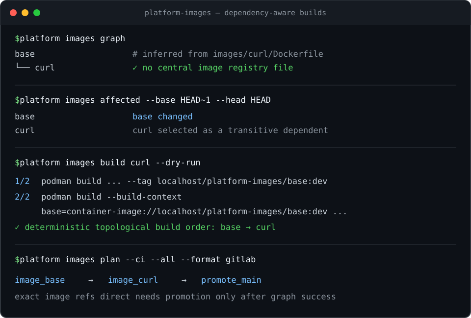

# Platform Images

[](https://github.com/davehewy/platform-images/actions/workflows/ci.yml)
[](https://github.com/davehewy/platform-images/actions/workflows/release.yml)
[](https://github.com/davehewy/platform-images/releases/latest)
[](https://github.com/davehewy/platform-images/issues)
[](LICENSE)
[](pyproject.toml)
[](https://buymeacoffee.com/davehewy)

> **Sick of manually orchestrating container-image builds in GitLab pipeline or GitHub Actions
> workflow files? This tool is for you.**

`platform-images` is a lightweight way to keep multiple container images in one repository. The
images may be completely independent, share a common parent, or form deeper dependency chains. When
something changes in an image directory or in shared build configuration, the tool selects the
smallest affected subgraph and orchestrates its rebuild.

For a repository owner, it answers one operational question:

> Given this Git change, which container images must be rebuilt, in what order, and with which
> exact versions of their local parent images?

A repository containing many Dockerfiles usually starts with one CI job per image. Over time that
becomes either wasteful (build every image on every commit) or unsafe (directory path rules rebuild
the directly edited image but miss its consumers). Independent images should remain independent;
related images should be rebuilt together only when their part of the graph changes. The dependency
information already exists in instructions such as `FROM base`, but normal CI path filters do not
understand it. They also do not solve how independently scheduled jobs pass the exact newly built
parent image to their consumers.

This tool discovers one target per direct directory containing a `Dockerfile` or `Containerfile`
beneath one or more configurable repository-relative roots (`images` by default). It infers
their **build-time** dependency graph, maps a Git diff onto that graph, and follows changes
downstream. It can render dynamic GitLab child-pipeline jobs or generate a complete GitHub Actions
workflow. Docker Buildx, Podman, Buildah, and nerdctl/BuildKit are supported explicitly. Every
build receives exact image references, and a default-branch pipeline promotes the affected graph
to stable tags only after the complete graph build succeeds. The pipeline also publishes a
commit-scoped manifest that tells later test, deployment, and release jobs exactly which immutable
image digest each target produced. Docker teams can additionally export the same local or CI plan
as a native Buildx Bake definition without maintaining another dependency file.

There is no second image catalogue or hand-maintained CI dependency list. The Dockerfiles or
Containerfiles and Git history remain the source of truth.

The intended delivery path is equally small: CI builds a commit once, publishes
`image-build-manifest.json`, and every later job reads the new image's `@sha256` reference from that
file. When the commit is ready to release, `promote-manifest` gives those same tested bytes a
semantic tag such as `v1.2.3`; it never rebuilds them. See
[From commit build to semantic release](#from-commit-build-to-semantic-release).

The inferred structure is a **directed acyclic graph (DAG)**. A dependency edge records that one
target consumes another; validation rejects any directed cycle and prints its complete path before
planning. Valid plans are deterministic topological projections of that DAG: dependencies build
before consumers, while unrelated nodes remain parallelizable.

## Contents

- [What this solves and what it does not](#what-this-solves-and-what-it-does-not)
- [Installation](#installation)
- [Quick start](#quick-start)
- [Image names, local references, and published repositories](#image-names-local-references-and-published-repositories)
- [The checked-in example](#the-checked-in-example)
- [Demonstration](#demonstration)
- [Worked examples](#worked-examples)
- [From commit build to semantic release](#from-commit-build-to-semantic-release)
- [Configuration capabilities](#configuration-capabilities)
- [Configuration reconciliation](docs/reconciliation.md)
- [Container backend compatibility](docs/container-backends.md)
- [Docker Buildx Bake export](docs/docker-bake.md)
- [Recommended adoption flow](#recommended-adoption-flow)
- [Command guide](#command-guide)
- [CI operating model](#ci-operating-model)
- [GitHub Actions workflow generation](docs/github-actions.md)
- [GitLab child pipelines](docs/gitlab-ci.md)
- [Performance and scaling](#performance-and-scaling)
- [Quality and integration checks](#quality-and-integration-checks)
- [Support and contributing](#support-and-contributing)
- [License](#license)

## What this solves and what it does not

For a platform or DevOps team, it solves:

- discovering image targets by repository convention;
- inferring local dependencies from `FROM`, `COPY`/`ADD --from`, and `RUN --mount=from`;
- rebuilding a changed image and every transitive consumer, while leaving unrelated images alone;
- building an affected consumer against either its newly built parent or an immutable digest of the
  existing stable parent;
- turning the calculated graph into a GitLab child pipeline or dependency-layered GitHub Actions
  workflow;
- executing the same exact-reference build contract with Docker Buildx, Podman, Buildah, or
  nerdctl/BuildKit;
- exporting an optional Docker Buildx Bake definition whose target contexts preserve the same DAG;
- using unique merge-request and commit tags, with graph-wide stable promotion on `main`;
- publishing a verified commit-to-image manifest for downstream test, deployment, and release jobs;
- promoting the already-tested digest to a semantic version without rebuilding it;
- making retries safe by verifying image identity before reusing an immutable output tag; and
- failing early on cycles, missing targets, ambiguous short image names, unsafe paths, and malformed
  Dockerfiles or Containerfiles.

It intentionally models **container build dependencies**, not runtime service relationships. It
will understand `FROM base` but not that an API container talks to PostgreSQL at runtime. It also
does not rebuild merely because a remote tag such as `alpine:3.22` changed without a Git change;
pin external bases by digest or use a dependency-update process when that distinction matters.

## Installation

### Standalone executable (recommended)

The quickest installation on Linux or macOS downloads the correct archive for the current machine,
verifies it against the release checksum, and installs `platform` into `~/.local/bin`:

```bash
curl -fsSL https://raw.githubusercontent.com/davehewy/platform-images/main/scripts/install.sh | sh
```

Install a specific version or choose another destination with environment variables:

```bash
curl -fsSL https://raw.githubusercontent.com/davehewy/platform-images/main/scripts/install.sh |
  PLATFORM_IMAGES_VERSION=0.13.0 PLATFORM_IMAGES_INSTALL_DIR=/usr/local/bin sh
```

On Windows, run this in PowerShell. It verifies the Windows archive, installs `platform.exe` below
`%LOCALAPPDATA%\Programs`, and adds its directory to the user `PATH`:

```powershell
irm https://raw.githubusercontent.com/davehewy/platform-images/main/scripts/install.ps1 | iex
```

Set `$env:PLATFORM_IMAGES_VERSION` or `$env:PLATFORM_IMAGES_INSTALL_DIR` first to pin a release or
change the destination.

Each [GitHub release](https://github.com/davehewy/platform-images/releases) provides:

| System | Architecture | Release asset |
| --- | --- | --- |
| GNU/Linux | AMD64 / x86_64 | `platform-images-v0.13.0-linux-amd64.tar.gz` |
| GNU/Linux | ARM64 / AArch64 | `platform-images-v0.13.0-linux-arm64.tar.gz` |
| macOS / Darwin | Intel AMD64 | `platform-images-v0.13.0-darwin-amd64.tar.gz` |
| macOS / Darwin | Apple Silicon ARM64 | `platform-images-v0.13.0-darwin-arm64.tar.gz` |
| Windows | AMD64 / x86_64 | `platform-images-v0.13.0-windows-amd64.zip` |
| Windows | ARM64 | `platform-images-v0.13.0-windows-arm64.zip` |

Every archive name contains its exact release version, so downloads from different releases remain
self-identifying when stored together. Each archive contains the native `platform` executable,
README, and MIT license. `SHA256SUMS` covers every archive, Python distribution, lockfile, and the
versioned SPDX JSON software bill of materials. GitHub publishes signed build provenance for every
downloadable payload and binds the SPDX SBOM to every archive, Python distribution, and lockfile.
The release tag is placed on the exact `main` commit that passed both CI gates; package and CLI
versions are derived from that immutable tag. Semantic-release never pushes an extra generated
version-bump commit to the protected branch and therefore needs neither a personal access token nor
a branch-protection bypass.
Verify a downloaded executable archive independently with:

```bash
gh attestation verify platform-images-v0.13.0-linux-amd64.tar.gz \
  --repo davehewy/platform-images
gh attestation verify platform-images-v0.13.0-linux-amd64.tar.gz \
  --repo davehewy/platform-images \
  --predicate-type https://spdx.dev/Document/v2.3
```

The Linux executables are built on
Ubuntu 22.04 and target modern
glibc-based 64-bit distributions. The macOS executables are built natively on Intel and Apple
Silicon runners. Windows executables are built natively for x86_64 and ARM64; GitHub currently
classifies its hosted Windows ARM64 runner as public preview.

The executable bundles Python and the Python package dependencies. Commands still expect the tools
they orchestrate to exist: Git for change inspection, a [supported build backend and registry
transport](docs/container-backends.md), and access to the configured registry. Generic OCI
registries use their Distribution API plus username/password or ambient transport credentials;
AWS CLI is required only when `registry.provider = "ecr"`.

### Install as a Python tool

If Python 3.12 is already part of the team's toolchain, `uv` can install an isolated, pinned release:

```bash
uv tool install --python 3.12 \
  "git+https://github.com/davehewy/platform-images.git@v0.13.0"
```

The universal `platform_images-<version>-py3-none-any.whl` and conventional Python source
`platform_images-<version>.tar.gz` are also attached to each GitHub release. The wheel is portable
across CPU architectures and operating systems with Python 3.12.

### Install for development

Clone the repository and install its locked development environment:

```bash
uv sync --locked --extra dev
```

This keeps Ruff, pytest, pre-commit, and Commitizen available. An ordinary editable pip environment
also works:

```bash
python3.12 -m venv .venv
source .venv/bin/activate
pip install -e ".[dev]"
```

## Quick start

Confirm which release is installed:

```bash
platform version
# platform-images 0.13.0
```

In a repository that already contains image target directories but no configuration, initialize it
from the existing layout:

```bash
platform init
```

`init` scans for existing `Dockerfile` and `Containerfile` targets, infers their parent directories
as discovery roots, and writes a Docker-based starter `platform-images.toml`. New configurations
use the generic OCI registry provider, so Nexus, GitLab Container Registry, GHCR, Harbor, and other
Distribution-compatible registries can resolve stable tags without pulling image layers. Select
`--registry-provider ecr` when AWS-native lookup and login are preferred. Discovery roots can
live at any depth and can be nested—for example, `utils` and `utils/container-images` can coexist.
Directories beneath those roots that do not contain either build filename are ordinary repository
directories and are ignored.
It also adds inferred short external bases such as `alpine` to the starter allowlist. Exact
qualified basenames form local edges automatically; when those references share one repository
path, `init` adopts it as the cascading output namespace rather than writing per-image entries.
Separator-only variants and strong unique near-matches are paired automatically. `init` writes the
smallest exact configuration needed to make those guesses reproducible, groups repeated references
to the same repository, and prints one review warning per inferred mapping. Genuine collisions stay
unmapped. It never moves an image, assumes a fixed root name, or overwrites an existing
configuration.

If auto-discovery is intentionally broader than the ownership areas you want, name each existing
target parent directory explicitly. The directories can be anywhere beneath the repository:

```bash
platform init \
  --discovery-root containers/shared \
  --discovery-root services/payments/container-images \
  --namespace platform/my-repository
```

Use `--builder podman`, `buildah`, or `nerdctl` when Docker is not the team's default. `init` chooses
the matching registry transport unless `--registry-transport` is set explicitly. Run
`platform init --help` to see all initialization choices.

As that repository evolves, rerun the inference safely against the existing configuration:

```bash
platform reconcile
```

It adds only unambiguous external bases and repository identity exceptions, prints the exact diff,
preserves existing output policy, comments, newlines, and file permissions, and rolls back if an
inferred edge introduces a new validation error. Use `platform reconcile --check` in CI to detect
available updates without modifying the checkout. See [configuration
reconciliation](docs/reconciliation.md) for the complete merge and safety rules.

If a Dockerfile obtains a registry prefix or complete parent reference from a global `ARG` without
a default, provide the deterministic checked-in value during initialization:

```bash
platform init \
  --build-arg SOURCE_REGISTRY=nexus.example.com/gitlab-runner
```

The generated `[dockerfile.arguments]` value is used for both dependency parsing and every real
build command, preventing the graph and the builder from interpreting different parent images.

Then, from the repository root:

```bash
platform images list
platform images validate
platform images graph
platform images build curl --dry-run
```

If installed through the development environment without activating it, prefix commands with
`uv run`:

```bash
uv run platform images list
uv run platform images validate
uv run platform images graph
uv run platform images build curl --dry-run
```

Remove `--dry-run` when the configured backend is available. New `platform init` configurations
select Docker explicitly because it is the most common starting point. Podman remains the
backward-compatible default when older configurations omit the build setting; select another
backend with `--builder`, or use `--engine` when its matching registry transport should be selected
too.

## Image names, local references, and published repositories

The tool separates three names that are often accidentally conflated:

1. **Logical target name** — the target directory name, such as `ubuntu-base-24-04`. This stable
   name is used by the graph, commands, plans, manifests, and CI relationships.
2. **Published repository** — the registry-relative destination, such as
   `gitlab/ubuntu-base-24-04`. The registry hostname is supplied separately through
   `PLATFORM_IMAGES_REGISTRY`.
3. **Tag or digest** — the repository version, such as `latest`, `sha-<commit>`, or
   `@sha256:...`. It does not define target identity.

Name each target directory for the image's stable role, using lowercase letters and numbers with
`.`, `_`, or `-` separators. That directory name is the repository-wide logical ID, so it must be
unique across every discovery root. Keep registry hosts, repository paths, and tags out of the
directory name; changing the directory name is an identity change, not merely a layout change.

For new or repository-owned Dockerfiles, prefer the short logical name:

```dockerfile
# utils/container-images/application/Dockerfile
FROM ubuntu-base-24-04
```

This is the clearest local contract: the checked-in target named `ubuntu-base-24-04` is a build
input. The planner binds it to the exact newly built image or unchanged stable digest, so the
consumer does not pull a mutable tag by accident.

Build these Dockerfiles through `platform images build` or the generated CI. A plain
`docker build`/`podman build` does not receive the controller's named contexts and may try to pull a
short logical name from a registry.

Qualified references require no per-image configuration when their final repository component
exactly equals a unique logical target. Given these targets:

```text
containers/
├── ubuntu24-04-base/Dockerfile
└── application/Dockerfile
```

the existing qualified source below automatically creates
`application -> ubuntu24-04-base`, regardless of registry hostname, repository path, tag, or
digest:

```dockerfile
FROM nexus.example.com/gitlab-runner/ubuntu24-04-base:latest
```

The same target can be referenced from several private or public registry hosts without listing
those hosts in configuration. An unmatched qualified source remains external. The tool only uses
an exact final-component match during ordinary graph construction; it never makes a fuzzy graph
edge at build time. `platform init` may make a reviewed best guess, but records that decision as an
exact repository or alias mapping before validating the graph.

The same rule applies when the reference is assembled through a build argument:

```dockerfile
ARG SOURCE_REGISTRY
FROM ${SOURCE_REGISTRY}/ubuntu24-04-base:latest
```

```toml
[dockerfile.arguments]
SOURCE_REGISTRY = "nexus.example.com/gitlab-runner"
```

The resolved source remains visible in `images show`, and every Docker, Podman, Buildah, or nerdctl
command receives `--build-arg SOURCE_REGISTRY=...`. Values in this table are committed build policy,
not secrets; registry passwords belong in CI secrets.

For an internal source containing an `ARG`, execution materializes a temporary Dockerfile in which
only that image operand points at the logical named context. Other uses of the same `ARG` remain
unchanged, and the checked-in Dockerfile is never edited. This makes prefix expressions such as
`${SOURCE_REGISTRY}/base:latest` bind to the exact planned parent consistently across Docker,
Podman, Buildah, and nerdctl instead of letting an engine pull the configured mutable spelling.

During `platform init`, a common observed path such as `gitlab-runner/<logical-target>` becomes the
single output namespace instead of generating one table per image:

```toml
[registry]
namespace = "gitlab-runner"
registry_environment_variable = "PLATFORM_IMAGES_REGISTRY"
stable_tag = "main"
```

With `PLATFORM_IMAGES_REGISTRY=nexus.example.com`, `ubuntu24-04-base` then publishes as:

```text
nexus.example.com/gitlab-runner/ubuntu24-04-base:sha-<full-commit-sha>
nexus.example.com/gitlab-runner/ubuntu24-04-base:main
```

Tags and digests are removed only while comparing identity. The exact expanded Dockerfile source is
then replaced with the planned commit-addressed image through a named build context, so the edge is
real in both `platform images graph` and the executed build. Inspect the evidence with:

```text
$ platform images show application
application
  dependencies: ubuntu24-04-base
  local_references:
    nexus.example.com/gitlab-runner/ubuntu24-04-base:latest -> ubuntu24-04-base (FROM, line 1)
```

### When the remote and local names differ

`platform init` optimizes for adopting an existing repository with minimal operator work. It first
removes the registry host, port, tag, and digest, then compares the registry-relative repository
with all discovered logical targets. It automatically accepts:

- an exact basename;
- a unique separator-insensitive basename, such as remote `ubuntu-24-04-base` and local
  `ubuntu24-04-base`; and
- a strong unique similarity match when the next-best candidate is clearly worse.

The most strongly represented repository path becomes the global `registry.namespace`. That value
cascades to every discovered target. `init` writes an `images.<target>.repository` only when a
target's actual remote name differs from `<registry.namespace>/<logical-target>`, and writes an
alias only for an additional or legacy input spelling. Twenty-seven consumers of one remote base
therefore produce one mapping, not twenty-seven warnings.

For example, these repeated sources:

```dockerfile
FROM nexus.example.com:8088/risk-repo/ubuntu-24-04-base:latest
```

paired with local directory `ubuntu24-04-base` generate only:

```toml
[registry]
namespace = "risk-repo"

[images."ubuntu24-04-base"]
repository = "risk-repo/ubuntu-24-04-base"
```

The registry endpoint remains environment configuration:

```bash
export PLATFORM_IMAGES_REGISTRY=nexus.example.com:8088
```

`init` also prints a compact audit record:

```text
Review warning: init applied 1 inferred repository mapping:
  - risk-repo/ubuntu-24-04-base -> ubuntu24-04-base
    (separator-normalized, 27 references; canonical repository override)
```

The generated mapping is exact from then on: graphing and building do not repeatedly guess. If
separator normalization maps to multiple local targets, or two candidates are too close, `init`
does not choose. Validation groups all occurrences of that remote repository into one warning and
recommends one primary configuration change for the whole repository rather than presenting three
equal-weight choices for every Dockerfile.

For an already configured repository, an unresolved near-match looks like:

```text
$ platform images validate
Validation passed (2 image targets).

Warnings: 1

containers/application/Dockerfile:1
  [probable-local-reference] qualified image repository resembles local target
  'ubuntu24-04-base' but is currently external (27 references across 27 build files):
  nexus.example.com/gitlab-runner/ubuntu24-base
```

When that spelling is only an accepted dependency input, `platform reconcile` can apply the single
recommended alias:

```toml
[images."ubuntu24-04-base"]
aliases = [
  "nexus.example.com/gitlab-runner/ubuntu24-base",
]
```

Use `repository` when that different name is also where the locally built image must be published.
`init` selects this automatically when the source belongs to its inferred output namespace. The
value is registry-relative and tagless:

```toml
[images."ubuntu24-04-base"]
repository = "gitlab-runner/ubuntu24-base"
```

If the near-match is genuinely external, suppress that one warning—and prevent automatic basename
matching if the names are equal—with an explicit exception:

```toml
[identity]
external_repositories = [
  "docker.io/vendor/ubuntu24-base",
]
```

During a registry migration, list old repository identities as tagless aliases:

```toml
[images.ubuntu-base-24-04]
repository = "gitlab/ubuntu-base-24-04"
aliases = [
  "old-nexus.example.com/legacy/ubuntu-base-24-04",
]
```

Aliases are accepted as dependency inputs but never become output destinations. Repository and
alias identities must be globally unique; validation fails rather than guessing if two targets
claim the same identity. `platform images show <target>` displays the effective repository,
aliases, and every exact Dockerfile source that formed a local edge.

The published repository's final component does not have to equal the logical target. For example,
this deliberately maps local target directory `foundation` to a differently named remote image:

```toml
[images.foundation]
repository = "gitlab/ubuntu-base-24-04"
```

`FROM nexus.example.com/gitlab/ubuntu-base-24-04:latest` then creates an edge to `foundation`.
An unrelated rename such as `foundation` to `ubuntu-base-24-04` has no defensible name similarity,
so configure it explicitly. Clever inference is reserved for unique evidence; it does not turn an
arbitrary remote repository into a local target.

## The checked-in example

The repository contains two deliberately small images beneath its configured default discovery
root:

```text
images/
├── base/
│   └── Dockerfile
└── curl/
    └── Dockerfile
```

`images/base/Dockerfile` starts from an allowed external image:

```dockerfile
FROM alpine:3.22

RUN printf '%s\n' 'platform-local-base-v1' > /etc/platform-base-marker
```

`images/curl/Dockerfile` names the local target `base` directly:

```dockerfile
FROM base

RUN apk add --no-cache curl

ENTRYPOINT ["curl"]
CMD ["--version"]
```

The tool resolves `base` as the checked-in target—not as `docker.io/library/base`—and discovers:

```text
Container image dependency graph
└── base
    └── curl
```

## Demonstration



The graphic uses the checked-in `base` and `curl` images. The commands below are copyable:

```bash
platform images list
platform images graph
platform images build curl --dry-run

# With GitLab registry and CI variables present:
platform images plan --ci --all --format gitlab

# Generate a ready-to-customize GitHub Actions workflow (Docker by default):
platform images generate-workflow github --output .github/workflows/container-images.yml

# Export the complete graph as native Docker Buildx Bake HCL:
platform images generate-bake --output docker-bake.hcl
docker buildx bake --file docker-bake.hcl --print
```

## Worked examples

Paths beginning with `images/` in the worked examples are outputs from this repository's checked-in
configuration, not a required layout. Set `discovery.roots` to any repository-relative locations
that reflect your ownership model; inventory, change mapping, plans, and rendered pipelines use
those paths instead.

### Worked example 1: inspect what the repository owns

Use this during adoption, review, or incident diagnosis to confirm that discovery agrees with the
team's mental model:

```console
$ platform images list
base
curl

$ platform images validate
Validation passed (2 image targets).

$ platform images show curl
curl
  build_file: images/curl/Dockerfile
  repository: platform-images/curl
  aliases: none
  dependencies: base
  local_references:
    base -> base (FROM, line 1)
  dependents: none

$ platform images graph
Container image dependency graph
└── base
    └── curl
```

Use `--format json` with `show`, `validate`, or `graph` when another tool needs to consume the
result. JSON output includes a schema version so it can be treated as an automation contract. Use
`platform images graph --ascii` when a terminal cannot display Unicode line-drawing characters.
For a diamond or other multi-parent DAG, every incoming edge remains visible, but a shared target's
children are expanded only on its first occurrence; later occurrences say `[already shown]` so a
large graph cannot explode into exponentially repeated terminal output.

### Worked example 2: build a dependent image locally

A developer asks to build `curl`. Its parent is included automatically:

```console
$ platform images build curl --dry-run
podman build --file images/base/Dockerfile --tag localhost/platform-images/base:dev images/base
podman build --build-context base=container-image://localhost/platform-images/base:dev --file images/curl/Dockerfile --tag localhost/platform-images/curl:dev images/curl
```

Without `--dry-run`, those commands execute in that order. The second build does not rewrite
`FROM base`; Podman binds the logical name through a named `container-image://` build context.

The equivalent Docker Buildx plan uses Docker's `docker-image://` named context and loads each
local result for its consumer:

```console
$ platform images build curl --engine docker --dry-run
docker buildx build --load --file images/base/Dockerfile --tag localhost/platform-images/base:dev images/base
docker buildx build --load --build-context base=docker-image://localhost/platform-images/base:dev --file images/curl/Dockerfile --tag localhost/platform-images/curl:dev images/curl
```

Buildah uses the same containers-storage named-context form as Podman. For a nerdctl local chain,
the controller exports each newly built parent as an exact OCI layout before binding it into the
consumer; this avoids treating `localhost/...` as a registry:

```bash
platform images build curl --builder buildah --dry-run
platform images build curl --builder nerdctl --dry-run
```

All four backends consume the same discovered graph and exact references; the backend changes
execution, not selection. The [compatibility matrix](docs/container-backends.md) explains daemon,
storage, and version requirements.

Docker teams can export that same selection as native Buildx Bake HCL:

```bash
platform images generate-bake --image curl --output docker-bake.hcl
docker buildx bake --file docker-bake.hcl --print
docker buildx bake --file docker-bake.hcl --load selected
```

The generated `curl` target receives `contexts = { "base" = "target:image-base" }`, so BuildKit
sees the dependency directly and may still build unrelated targets in parallel. Qualified Nexus,
GitLab, GHCR, and other configured local spellings are bound to the same parent target. Configured
ARG-based image references are safely materialized as `dockerfile-inline`; ordinary build files
remain referenced by path. See [Docker Buildx Bake export](docs/docker-bake.md) for affected CI
plans, immutable unchanged parents, `--push`, metadata, and the deliberate Docker-only boundary.

When the stable local parent is already present and only the leaf needs rebuilding, opt out of the
upstream closure explicitly:

```bash
platform images build curl --no-deps
```

Use `--no-deps` deliberately: it trusts the existing
`localhost/platform-images/base:dev` rather than recreating it.

### Worked example 3: a leaf image changes

Suppose a merge request edits only `images/curl/Dockerfile`:

```bash
BASE_SHA=$(git merge-base HEAD origin/main)

platform images changed --base "$BASE_SHA" --head HEAD
# curl

platform images affected --base "$BASE_SHA" --head HEAD
# curl
```

`base` is not rebuilt because no consumer needs a new base. The `curl` plan still needs an exact
parent, so CI resolves `base:main` through the configured ECR or generic OCI provider and injects
an immutable reference. An ECR example is:

```text
123456789012.dkr.ecr.eu-west-2.amazonaws.com/platform-images/base@sha256:<digest>
```

This is the important partial-rebuild case: the leaf is rebuilt, its unchanged parent is reused,
and the parent cannot move underneath the running build.

For offline plan inspection, provide the stable lookup instead of calling either registry API:

```bash
export PLATFORM_IMAGES_REGISTRY=123456789012.dkr.ecr.eu-west-2.amazonaws.com
export PLATFORM_IMAGES_STABLE_REFS='{
  "base": "123456789012.dkr.ecr.eu-west-2.amazonaws.com/platform-images/base@sha256:<digest>"
}'
export CI_PIPELINE_ID=812
export CI_MERGE_REQUEST_IID=42

platform images plan --base "$BASE_SHA" --head HEAD --format json
```

### Worked example 4: a base image changes

Now suppose the change is under `images/base/`:

```console
$ platform images changed --base "$BASE_SHA" --head HEAD
base

$ platform images affected --base "$BASE_SHA" --head HEAD
base
curl
```

`curl` is included because it is a transitive dependent of `base`. In a larger graph, traversal
continues through every downstream consumer. Unrelated roots and their consumers remain absent.

A complete merge-request plan for the checked-in graph looks like this:

```console
$ platform images plan --ci --all
Build plan (merge_request):
  base
    reasons: all-images
    output: 123456789012.dkr.ecr.eu-west-2.amazonaws.com/platform-images/base:ci-812-0123456789abcdef0123456789abcdef01234567
  curl
    reasons: all-images, dependent-of:base
    output: 123456789012.dkr.ecr.eu-west-2.amazonaws.com/platform-images/curl:ci-812-0123456789abcdef0123456789abcdef01234567
    needs: base
    input base: 123456789012.dkr.ecr.eu-west-2.amazonaws.com/platform-images/base:ci-812-0123456789abcdef0123456789abcdef01234567
```

Both targets use the same pipeline-unique identity. `curl` consumes the output produced by the
`base` job in this plan, rather than the older stable base.

For the exact illustrative references above, `CI_COMMIT_SHA` was set explicitly:

```bash
export CI_COMMIT_SHA=0123456789abcdef0123456789abcdef01234567
platform images plan --ci --all
```

### Worked example 5: generate the GitLab jobs

The parent pipeline calculates once, persists the JSON plan, and renders a child pipeline from that
same artifact:

```yaml
generate-image-pipeline:
  variables:
    GIT_DEPTH: "0"
  script:
    - platform images validate
    - platform images plan --ci --format json > image-plan.json
    - platform images render-plan image-plan.json --format gitlab > generated-images.yml
  artifacts:
    paths: [image-plan.json, generated-images.yml]
```

For the `base -> curl` merge-request plan, the generated portion is equivalent to:

```yaml
stages: [build, manifest, consume]

image_base:
  extends: .image-build
  script:
    - platform images ci-build base --output-ref <registry>/platform-images/base:ci-812-<sha> --result-file image-results/base.json
  artifacts:
    paths: [image-results/base.json]

image_curl:
  extends: .image-build
  needs: [image_base]
  script:
    - platform images ci-build curl --output-ref <registry>/platform-images/curl:ci-812-<sha> --input-ref base=<registry>/platform-images/base:ci-812-<sha> --result-file image-results/curl.json
  artifacts:
    paths: [image-results/curl.json]

publish_image_manifest:
  stage: manifest
  script:
    - platform images build-manifest image-results --mode merge_request --commit-sha <sha> --expected-target base --expected-target curl --output image-build-manifest.json
  artifacts:
    paths: [image-build-manifest.json]
```

The `needs` edge is derived from the Dockerfile. Because every job pushes its unique output before
completion, `image_curl` can run on a different GitLab runner with no shared container-engine image
store. The later manifest stage waits for the complete build stage and receives every result
artifact without adding a `needs` entry for every image, so even the repository's 360-image stress
graph does not make the manifest job run into GitLab's per-job dependency limit.

The renderer also checks the complete generated child-pipeline job count before writing YAML. Its
default `--gitlab-max-jobs 500` matches the current GitLab.com Free pipeline limit and includes one
job per affected image, the manifest job, and the default-branch promotion job when present. Set a
higher value only when the selected [GitLab tier or self-managed
instance](https://docs.gitlab.com/user/gitlab_com/#gitlab-cicd) actually allows it:

```bash
platform images render-plan image-plan.json --format gitlab \
  --gitlab-max-jobs 1500 > generated-images.yml
```

Jobs added in the locally included project template share that same child-pipeline budget, so leave
room for scanners and deploy jobs. This is an early diagnostic, not a way to bypass a provider
limit: the tool will not split a dependency graph into disconnected GitLab pipelines and silently
weaken its artifact or `needs` guarantees.

The generated stage list also includes `consume`. Define project-specific scan, integration-test,
or review-deploy jobs in the locally included GitLab template, give them `stage: consume`, and use
`needs: [{job: publish_image_manifest, artifacts: true}]`. Default-branch `main` promotion waits for
those jobs rather than bypassing them.

### Worked example 6: generate a GitHub Actions workflow

Generate the complete workflow into the conventional location:

```bash
platform images generate-workflow github \
  --default-branch main \
  --engine docker \
  --output .github/workflows/container-images.yml
```

For `base -> curl`, the workflow has two static build layers. The planning job calculates the
affected set once and emits a dynamic matrix for each layer:

```text
validate -> plan -> image_layer_0 [base] -> image_layer_1 [curl] -> manifest -> promote
```

Independent targets in the same layer run in parallel. A changed leaf with no rebuilt parent moves
into the first runtime layer and consumes its unchanged parent by stable digest. Empty layers use a
no-op sentinel because GitHub rejects an empty matrix. The authoritative JSON plan travels between
jobs as an artifact, and each matrix entry reloads and validates that plan before building its exact
target. Every matrix entry uploads its digest result; `manifest` verifies those results against the
plan and publishes `image-build-manifest-<commit>` for later jobs.

GitHub permits at most [256 jobs generated by one matrix](https://docs.github.com/en/actions/reference/limits#existing-system-limits).
When a dependency-safe layer is wider than that, the generator automatically creates parallel
`image_layer_<n>_shard_<m>` jobs and partitions the targets into deterministic chunks of at most
256. Every shard in a layer waits for every shard in the previous layer, so a 600-image independent
layer runs as 256 + 256 + 88 without flattening or serialising the graph. Narrow dependency chains
still use one job per layer; the generator calculates a fast path-cover bound rather than
multiplying every layer by the repository's total image count.

GitHub job dependencies are part of the checked-in workflow definition, so they cannot be invented
after a run starts. The generator solves that constraint by creating enough static layers for the
current graph and filling them dynamically from the change plan. If a graph edit becomes deeper
than the checked-in workflow, planning fails with a regeneration instruction instead of dropping a
dependency. Regenerate and commit the workflow whenever image relationships change.

The default workflow uses Docker Buildx on `ubuntu-latest`; registry authentication follows
`platform-images.toml`. A generic OCI configuration uses the `PLATFORM_IMAGES_REGISTRY` repository
variable plus the same-named username/password secrets configured under `[registry]`. An ECR
configuration uses `PLATFORM_IMAGES_REGISTRY`, `AWS_ROLE_TO_ASSUME`, and `AWS_REGION` variables
with short-lived AWS OIDC credentials. Pull requests from forks run graph validation but do not
receive registry credentials or execute image builds. For a pre-authenticated self-hosted ECR
runner with Podman:

```bash
platform images generate-workflow github \
  --runner self-hosted \
  --engine podman \
  --aws-auth ambient \
  --output .github/workflows/container-images.yml
```

See [GitHub Actions](docs/github-actions.md) for the trust model, generated job structure, required
variables, and regeneration contract.

### Worked example 7: merge request versus default branch

Merge requests create isolated images and never update the stable alias:

```text
<registry>/platform-images/base:ci-812-<full-commit-sha>
<registry>/platform-images/curl:ci-812-<full-commit-sha>
```

The default branch creates commit-addressed outputs:

```text
<registry>/platform-images/base:sha-<full-commit-sha>
<registry>/platform-images/curl:sha-<full-commit-sha>
```

It also adds one final job:

```yaml
promote_main:
  stage: promote
  script:
    - platform images promote --source <registry>/platform-images/base:sha-<sha> --destination <registry>/platform-images/base:main
    - platform images promote --source <registry>/platform-images/curl:sha-<sha> --destination <registry>/platform-images/curl:main
```

If either build or manifest verification fails, promotion never starts. Registry updates across
several repositories are not transactional, however, so a network failure during promotion can
still update only some mutable aliases. Deployments that require a coherent set should consume the
digest-pinned manifest rather than several moving `main` tags.

### Worked example 8: no image-related change

A documentation change outside configured global inputs affects no target:

```bash
platform images affected --base "$BASE_SHA" --head HEAD
# no output
```

GitLab will not accept a child pipeline with no runnable jobs, so the renderer emits a successful
manifest job. It records the commit and an empty `images` object, which is an explicit, useful
answer for downstream automation:

```yaml
stages: [build, manifest, consume]
publish_image_manifest:
  stage: manifest
  script:
    - echo "No container images are affected."
    - platform images build-manifest --mode merge_request --commit-sha <sha> --output image-build-manifest.json
  artifacts:
    paths: [image-build-manifest.json]
```

The parent pipeline remains structurally identical whether zero, one, or hundreds of images are
selected.

### Worked example 9: a shared build input changes

Some files affect every image even though they do not live beneath a configured discovery root.
Add those paths to `changes.global_inputs`:

```toml
[changes]
global_inputs = [
  "shared/install-ca-certificates.sh",
  "shared/company-root-ca.pem",
  "build/container-policy/**",
]
```

A change to any matching path selects every discovered target. Use this for real shared build
inputs only; adding broad application or documentation paths defeats selective rebuilding.

Controller-critical paths are always global even if omitted from configuration:

```text
.gitlab-ci.yml
.gitlab/**
.github/workflows/**
platform-images.toml
pyproject.toml
src/platform_images/**
uv.lock
```

These mandatory patterns cannot be configured away, because a controller or pipeline change must
re-evaluate the entire image set safely.

### Worked example 10: add another local image

Add a direct directory with exactly one `Dockerfile` or `Containerfile`; do not hand-write a
corresponding CI job:

```text
images/debug/Dockerfile
```

```dockerfile
FROM curl

RUN apk add --no-cache bind-tools jq
```

Validation and graph inspection now produce:

```console
$ platform images validate
Validation passed (3 image targets).

$ platform images graph
Container image dependency graph
└── base
    └── curl
        └── debug
```

A change to `base` rebuilds `base`, `curl`, and `debug`; a change to `curl` rebuilds `curl` and
`debug`; a change to `debug` rebuilds only `debug`. The generated child pipeline grows by one job
and adds the correct `needs` edge automatically.

Dependencies can appear outside `FROM` too:

```dockerfile
FROM alpine:3.22
COPY --from=base /etc/platform-base-marker /marker
RUN --mount=from=curl,target=/tools,ro cp /tools/usr/bin/curl /usr/local/bin/curl
```

Local references in `COPY`/`ADD --from` and `RUN --mount=from` participate in the same graph.
Numeric and named stages inside one build file remain stages rather than image targets. A
`Containerfile` uses the same instruction syntax and graph rules as a `Dockerfile`; if both names
exist in one target directory validation fails rather than guessing which is authoritative.

### Worked example 11: keep unrelated images independent

Not every image needs to belong to the same chain. Add an independent utility image:

```text
images/healthcheck/Dockerfile
```

```dockerfile
FROM busybox:1.37

CMD ["wget", "--help"]
```

Because `busybox` is an allowed external image rather than a local target, the repository becomes a
forest with two roots:

```text
Container image dependency graph
├── base
│   └── curl
└── healthcheck
```

The selection behavior is now:

| Changed directory | Rebuilt images | Why |
| --- | --- | --- |
| `images/base/**` | `base`, `curl` | Rebuild the changed target and its local consumer. |
| `images/curl/**` | `curl` | The leaf changed; its parent remains an immutable stable input. |
| `images/healthcheck/**` | `healthcheck` | It is an independent root with no local consumers. |
| configured shared input | `base`, `curl`, `healthcheck` | The shared input is declared to affect every target. |

This is the central reason to calculate a graph instead of maintaining a single “images changed”
switch: independent images stay cheap, while dependent images stay correct.

### Worked example 12: bootstrap and recovery

On the first default-branch pipeline, GitLab supplies an all-zero `CI_COMMIT_BEFORE_SHA` and GitHub
supplies an all-zero `github.event.before`. There is no valid previous commit to compare, so the
controller deliberately builds the complete graph.

For a manual bootstrap or recovery rebuild, request the same behavior explicitly:

```bash
platform images plan --ci --all --format json > image-plan.json
platform images render-plan image-plan.json --format gitlab > generated-images.yml
```

Use `--ci --all` after introducing the tool, creating a new registry namespace, or intentionally
invalidating every stable image. Normal pipelines should use `--ci` so Git determines the minimal
affected set.

### Worked example 13: catch dependency mistakes before CI spends money

If `curl` accidentally says `FROM bsae`, validation does not silently pull an unrelated public
image:

```text
images/curl/Dockerfile:1
  unqualified image reference is neither a local target nor an allowed external image: bsae
  possible local target: base
```

If a local image directory is deleted while a surviving Dockerfile still references it, planning
also fails. If images reference each other cyclically, validation reports the deterministic cycle.
These fail-closed checks turn repository mistakes into reviewable errors rather than surprising
registry pulls or deadlocked pipelines.

### Worked example 14: discover images across several ownership areas

A monorepo does not need to move every container definition under one directory. Point discovery
at the existing areas instead:

```toml
[discovery]
roots = [
  "containers/shared",
  "services/payments/container-images",
  "platform/observability/builds",
]
```

```text
containers/shared/base/Containerfile
services/payments/container-images/api/Dockerfile       # FROM base
services/payments/container-images/worker/Dockerfile    # FROM base
platform/observability/builds/collector/Containerfile   # independent
```

Discovery produces one repository-wide graph:

```text
Container image dependency graph
├── base
│   ├── api
│   └── worker
└── collector
```

A change beneath `services/payments/container-images/api/` selects only `api`; a change beneath
`containers/shared/base/` selects `base`, `api`, and `worker`. The roots only locate targets—the
target names and inferred edges are global. Consequently, defining `api` beneath two roots is an
error with both paths reported.

Roots may be nested when a repository has ownership areas at different depths:

```toml
[discovery]
roots = ["utils", "utils/container-images"]
```

With that configuration, `utils/tool/Dockerfile` defines `tool`, while
`utils/container-images/api/Dockerfile` defines `api`. The `container-images` grouping directory is
not mistaken for a target. Matching considers every configured root, so if `utils/container-images`
is itself a real outer target with a build file, changes in a more deeply nested target select both
the nested target and the containing image context. This keeps rebuild detection conservative when
Docker build contexts genuinely nest.

## From commit build to semantic release

The recommended process is **build once, test by digest, promote the same digest**:

```text
Git commit
  -> affected DAG plan
  -> commit-addressed build and registry push
  -> image-build-manifest.json
  -> tests / review deployment use @sha256
  -> release automation promotes @sha256 to :v1.2.3
```

Do not rebuild an image after deciding it passed. A second build of the same source can differ
because an external base, package index, timestamp, or build service changed. The registry digest
is the identity of the bytes that were actually tested; the Git SHA identifies their source. The
manifest joins those two identities.

### What every successful pipeline publishes

Every generated build job writes a small result artifact. The final manifest job requires exactly
one result for every planned target and verifies the commit, project source, tag/digest pairing,
immutable reference, and dependency inputs. GitHub additionally reloads the authoritative plan and
checks every result against it; GitLab's result-producing commands are rendered directly from that
plan. GitHub publishes an artifact named `image-build-manifest-<commit>`; GitLab's
`publish_image_manifest` job publishes the same `image-build-manifest.json` file, including for a
no-change plan.

A two-image manifest looks like this (digests shortened here only for readability):

```json
{
  "schema_version": 1,
  "mode": "default_branch",
  "base_sha": "<previous-commit>",
  "commit_sha": "0123456789abcdef0123456789abcdef01234567",
  "source": "https://github.com/acme/containers",
  "images": {
    "base": {
      "reference": "registry.example/acme/base:sha-0123456789abcdef0123456789abcdef01234567",
      "digest": "sha256:<base-digest>",
      "immutable_reference": "registry.example/acme/base@sha256:<base-digest>",
      "input_references": {}
    },
    "curl": {
      "reference": "registry.example/acme/curl:sha-0123456789abcdef0123456789abcdef01234567",
      "digest": "sha256:<curl-digest>",
      "immutable_reference": "registry.example/acme/curl@sha256:<curl-digest>",
      "input_references": {
        "base": "registry.example/acme/base:sha-0123456789abcdef0123456789abcdef01234567"
      }
    }
  }
}
```

The references have deliberately different jobs:

| Identifier | Meaning | Recommended use |
| --- | --- | --- |
| `:ci-<pipeline>-<commit>` | Isolated merge-request output. | Review environments and integration tests; never release it. |
| `:sha-<commit>` | Human-searchable default-branch build identity. | Retry, audit, and locating a commit's output. Treat it as immutable. |
| `@sha256:<digest>` | Immutable registry content identity. | Tests, deployments, provenance records, and promotion sources. This is the safest handoff. |
| `:v1.2.3` | Human semantic release name for an already-tested digest. | Release configuration and user-facing documentation. Make version tags immutable in the registry. |
| `:main` | Moving convenience channel. | Development consumers that deliberately want the latest successful default-branch result. Do not use it as release evidence. |

### Use a newly built image in the next job

Download the manifest artifact, select the logical target, and fail if it is absent:

```bash
IMAGE_NAME=curl
IMAGE_REF="$(jq -er --arg name "$IMAGE_NAME" \
  '.images[$name].immutable_reference' image-build-manifest.json)"

docker pull "$IMAGE_REF"
docker run --rm "$IMAGE_REF" --version
```

Podman, Buildah, and nerdctl accept the same digest-pinned registry reference. A deployment job can
write `IMAGE_REF` to a Helm value, Kustomize image override, Terraform input, or deployment API.
Record the full digest in the deployed revision so rollback and incident response do not depend on
where a mutable tag points later.

The manifest contains only the affected build set. That is normally what a test or deployment job
wants: if `curl` changed, use its new digest; if it did not, do not redeploy it. An empty `images`
object means the controller deliberately found no image work—it is not a missing artifact.

### Turn a tested commit into a semantic container release

Let the versioning tool calculate a version only after the commit build and required tests pass.
Then authenticate the chosen registry transport and promote from the manifest:

```bash
RELEASE_TAG=v1.2.3

platform images registry-login --registry-transport docker
platform images promote-manifest image-build-manifest.json \
  --tag "$RELEASE_TAG" \
  --expected-commit "$CI_COMMIT_SHA" \
  --registry-transport docker
```

`promote-manifest` pulls each `@sha256` source, applies the semantic destination tag in the same
image repository, and pushes it. It refuses a merge-request manifest, a manifest for another
commit, an invalid container tag, a missing selected image, or a manifest whose digest fields are
internally inconsistent. Use repeated `--image <name>` options when a release should contain only
specific images; omit them to promote every image in the manifest.

Two release models are reasonable:

- **Changed-image releases:** an ordinary default-branch manifest contains only changed images and
  their affected consumers. Promote those entries. This is efficient and works well when each
  image has an independent release history.
- **Coordinated repository releases:** if `v1.2.3` must exist for every image, make the release
  candidate pipeline use `platform images plan --ci --all` (or GitHub's generated `rebuild_all`
  input), test that full manifest, and then promote all of it. Do not assume an ordinary partial
  manifest represents an unchanged image.

If semantic-release runs in a later workflow or pipeline, retrieve the manifest artifact for the
release commit—not merely the newest successful run—and pass that SHA through `--expected-commit`.
Retain manifest artifacts and commit-addressed registry outputs for at least the release and
rollback window. If the artifact cannot be found, fail the release rather than silently rebuilding
or using `main`.

Promotion across multiple image repositories is gated but not transactionally atomic: all builds
and manifest verification finish before it starts, but a registry or network failure can interrupt
the sequence. Consumers that must roll out a coherent multi-image set should treat the manifest as
the release bill of materials and deploy all `@sha256` values from it. Semantic tags and `main` are
useful names; the manifest is the exact set.

## Configuration capabilities

Configuration lives in `platform-images.toml`. The fastest safe way to create it is:

```bash
platform init
```

Use this when adopting the tool in an existing repository: it derives discovery roots from the
locations of existing build files, infers unqualified external base names, consolidates a common
qualified local-image path into one cascading output namespace, applies unique high-confidence
remote-to-local repository matches, and validates the resulting exact graph. Pass repeatable
`--discovery-root` options when you want to declare ownership areas explicitly, `--namespace` when
the registry hierarchy differs from the repository name, and `--builder` when Docker is not the
right default. The command refuses to replace `platform-images.toml`; configuration changes after
initialization can use `platform reconcile` for additive high-confidence updates while retaining
the existing namespace, output overrides, discovery roots, unrelated settings, and comments. It
prints a reviewable diff and inference audit; genuine ambiguities remain grouped warnings. Use
`--check` to enforce that drift in CI. Namespace changes, output redirection, discovery ownership
changes, and removal of old mappings remain ordinary reviewed source changes.

Bake export deliberately adds no second configuration table. `generate-bake` consumes the same
discovery roots, canonical repositories, aliases, Dockerfile ARG values, tag policy, and registry
inputs as every other planner and renderer. Use normal Buildx `--set`, `--load`, `--push`, secret,
cache, and platform options for execution-only concerns rather than duplicating them in
`platform-images.toml`.

This repository's complete configuration is:

```toml
[registry]
namespace = "platform-images"
registry_environment_variable = "PLATFORM_IMAGES_REGISTRY"
stable_tag = "main"
transport = "podman"
provider = "ecr"
authentication = "ecr"
scheme = "https"

[tags]
ci_prefix = "ci"
commit_prefix = "sha"

[build]
backend = "podman"

[discovery]
roots = ["images"]

[dockerfile]
allowed_short_external_images = ["alpine", "busybox"]

[changes]
global_inputs = [
  "src/platform_images/**",
  "pyproject.toml",
  "uv.lock",
  "platform-images.toml",
  ".gitlab-ci.yml",
  ".gitlab/**",
  ".github/workflows/**",
]
```

### Registry settings

| Setting | What it controls | When and why to change it |
| --- | --- | --- |
| `registry.namespace` | Default output prefix between the registry host and logical target name. Local images use the same path beneath `localhost/`; an `images.<target>.repository` entry overrides it for that target. It does not restrict which source registries can form edges. | Change it once to match the team's usual output hierarchy, such as `platform/base-images`. `init` adopts one consistently observed qualified path automatically, while explicit `--namespace` wins. |
| `registry.registry_environment_variable` | The environment-variable name from which the registry hostname is read. | Keep the default when one standard variable is acceptable. Change it to align with an established CI variable such as `COMPANY_ECR_REGISTRY` without hard-coding an account or region in the repository. |
| `registry.stable_tag` | The mutable alias resolved for unchanged parents and updated after a successful default-branch graph. | `main` is a clear default. Change it to `stable`, `production`, or another existing convention. This is a build baseline, not an environment deployment mechanism. |
| `registry.transport` | The CLI used for login, retry inspection, push, and promotion. Accepted values are `docker`, `podman`, `buildah`, and `nerdctl`. | Usually match the builder. Podman and Buildah may be mixed because they share containers-storage; Docker and nerdctl require their matching transport. |
| `registry.provider` | Stable-tag resolver. `oci` uses the standard registry Distribution API; `ecr` uses AWS `DescribeImages`. Existing configurations default to `ecr`; new `init` configurations default to `oci`. | Use `oci` for Nexus, GitLab Registry, GHCR, Harbor, Docker Registry, and similar services. Use `ecr` when AWS-native identity and regional checks are wanted. |
| `registry.authentication` | Login policy: `credentials` or `ambient` for OCI, and `ecr` for ECR. | Use `credentials` on ordinary hosted runners. Use `ambient` only when a trusted runner already configured the transport and stable-manifest API access is anonymous or the runner exposes both configured credential variables. Use `ecr` with AWS workload identity. |
| `registry.username_environment_variable` / `password_environment_variable` | Names of the two secret environment variables consumed by OCI API lookup and `registry-login`. Defaults to `PLATFORM_IMAGES_REGISTRY_USERNAME` and `PLATFORM_IMAGES_REGISTRY_PASSWORD`. | Rename them to established protected CI variable names. Values never belong in TOML; generated GitHub workflows read same-named repository secrets. |
| `registry.scheme` | `https` by default; controls generic OCI manifest and token requests. | Keep HTTPS. Set `http` only for an explicitly trusted internal development registry; ECR always requires HTTPS. |

For ECR, the registry value is the host only:

```bash
export PLATFORM_IMAGES_REGISTRY=123456789012.dkr.ecr.eu-west-2.amazonaws.com
```

The account and region are parsed from that hostname and passed explicitly to AWS CLI operations.

For Nexus or another OCI registry, keep the hostname equally separate and provide protected
credentials under the configured variable names:

```toml
[registry]
namespace = "gitlab-runner"
registry_environment_variable = "PLATFORM_IMAGES_REGISTRY"
stable_tag = "main"
transport = "docker"
provider = "oci"
authentication = "credentials"
username_environment_variable = "NEXUS_USERNAME"
password_environment_variable = "NEXUS_PASSWORD"
scheme = "https"
```

```bash
export PLATFORM_IMAGES_REGISTRY=nexus.example.com
export NEXUS_USERNAME="$CI_NEXUS_USERNAME"
export NEXUS_PASSWORD="$CI_NEXUS_TOKEN"
platform images registry-login
```

Stable parent lookup uses `GET /v2/<repository>/manifests/<stable-tag>`, handles Basic and Bearer
challenges, validates `Docker-Content-Digest` (or computes it from the manifest bytes), and never
pulls image layers merely to calculate a plan.

For GHCR in a generated GitHub workflow, set the configured variable names to `GITHUB_ACTOR` and
`GITHUB_TOKEN`. The renderer then uses the workflow's native actor/token and grants package-write
permission only to jobs that access the registry; no duplicate credential secrets are required.

### Image identity settings

The `[images.<logical-target>]` tables are optional. Without one, the published repository is
`<registry.namespace>/<logical-target>` and the short logical name is the recommended local
Dockerfile reference. A qualified reference also resolves automatically when its final repository
component exactly matches the logical target; registry hostnames and intermediate paths do not
need to be registered.

Repository configuration cascades from broad policy to narrow exceptions:

1. An explicit `platform init --namespace` is the global output prefix and always wins.
2. Without that option, `init` selects the dominant qualified local-reference path as the global
   `registry.namespace` when the evidence has one winner.
3. Every target then publishes to `<registry.namespace>/<logical-target>` without an image table.
4. `images.<target>.repository` overrides only a canonical remote-name exception.
5. `images.<target>.aliases` adds only legacy or additional dependency spellings and never changes
   the output destination.

This keeps a 300-image repository on one global setting when its naming is uniform while still
allowing a handful of real exceptions. Repeated consumers never require repeated configuration.

| Setting | What it controls | When and why to change it |
| --- | --- | --- |
| `images.<target>.repository` | Exceptional registry-relative output repository and canonical qualified dependency identity. It must not contain a registry hostname, tag, or digest. | Use only when this target's pushed name differs from the global `<registry.namespace>/<target>` convention, including when the remote basename differs from the logical target. |
| `images.<target>.aliases` | Exceptional tagless full or registry-relative repositories that resolve to this logical target. Aliases are inputs only. | Use when a remote basename differs from the logical target or during a rename. Exact-basename qualified references need no alias. |
| `identity.external_repositories` | Tagless qualified or registry-relative repositories that must remain external. | Use only for a genuine name collision or to acknowledge a `probable-local-reference` warning. Ordinary private and public external images need no entry. |

The registry host remains an environment or CI concern. For example, configure
`repository = "gitlab/ubuntu-base-24-04"` and set
`PLATFORM_IMAGES_REGISTRY=nexus.example.com`; do not put `nexus.example.com` or `:latest` in the
`repository` setting. Validation rejects stale target entries, tagged aliases, and identities
claimed by more than one target. `platform init` consolidates one common qualified-reference path
into `registry.namespace`, selects a clearly dominant path during migrations, and writes only
remote-basename exceptions below `[images]`; explicit `--namespace` always wins.

### Tag settings

| Setting | What it controls | When and why to change it |
| --- | --- | --- |
| `tags.ci_prefix` | Prefix for merge-request outputs: `<prefix>-<pipeline-id>-<commit-sha>`. | Change it when registry lifecycle rules or naming policy expect a prefix such as `mr` or `review`. Pipeline and commit identity remain part of the tag. |
| `tags.commit_prefix` | Prefix for default-branch immutable outputs: `<prefix>-<full-commit-sha>`. | Change it to match retention or audit conventions, for example `git`. Do not make this a mutable channel name; retry and collision safety rely on commit-specific outputs. |

The stable tag is deliberately separate from immutable output tags. Builds publish unique outputs;
promotion moves only the stable alias after success.

### Discovery settings

| Setting | What it controls | When and why to change it |
| --- | --- | --- |
| `discovery.roots` | Non-empty array of repository-relative directories to search. A direct child is an image target only when it contains `Dockerfile` or `Containerfile`; every other directory is ignored. Defaults to `["images"]`. | Include each existing ownership area that contains image targets, whether central, service-local, deeply nested, or beneath another ownership area. Roots cannot be absolute, escape through `..`, or duplicate one another. |
| `discovery.root` | Backward-compatible singular form for one root. | Existing configurations may keep it. New configurations should use `roots`, even for one location, so adding another is a one-line change. Do not set both forms. |

For example, this discovers `base`, `api`, and `worker` without a registration list:

```toml
[discovery]
roots = ["containers/shared", "services/payments/images"]
```

```text
containers/shared/
└── base/Containerfile
services/payments/images/
├── api/Dockerfile
└── worker/Dockerfile
```

Target ownership, Git change mapping, validation paths, contexts, and generated plans all use the
matching configured root. Names remain repository-wide logical identifiers, so `api` can use
`FROM base` across roots without encoding either directory in the Dockerfile. Every logical name
must therefore be unique across all roots, case-insensitively.

### Build backend and registry transport settings

| Setting | What it controls | When and why to change it |
| --- | --- | --- |
| `build.backend` | CLI that turns a Dockerfile or Containerfile into an image. Accepted values are `docker`, `podman`, `buildah`, and `nerdctl`. | Use Docker Buildx for the simplest GitHub-hosted setup, Podman or Buildah for daemonless containers-storage fleets, and nerdctl for containerd/BuildKit environments. Override it with `--builder`. |
| `registry.transport` | CLI that authenticates, inspects retry candidates, pushes when required, and promotes stable tags. | Match Docker with Docker and nerdctl with nerdctl. Podman and Buildah are interchangeable when they use the same containers-storage configuration. Override it with `--registry-transport`. |

The older `[build] engine = "..."` setting and `--engine` option remain compatible shorthands that
select a matching builder and transport. New configuration should use the two explicit axes. An
incompatible pair fails during configuration loading rather than discovering a local-store mismatch
halfway through a pipeline.

Docker Buildx and nerdctl/BuildKit push directly in CI; Docker reads BuildKit metadata and nerdctl
pulls the unique output back for identity and digest verification. Local nerdctl dependency chains
use temporary OCI layouts, while registry-backed CI contexts remain `docker-image://` references.
Podman and Buildah build into shared containers-storage and push with `--digestfile`. Planning,
tags, dependency order, OCI identity labels, retry collision checks, and promotion gates are
identical. See the complete [support and version matrix](docs/container-backends.md).

### DAG and edge semantics

If a target named `curl` contains `FROM base`, the stored relationship is “`curl` depends on
`base`”. Human tree output places `base` above `curl`, and schedulers receive the corresponding
execution constraint “build `base` before `curl`”. Multi-parent relationships from `FROM`,
`COPY`/`ADD --from`, and `RUN --mount=from` remain one DAG rather than being flattened into a tree;
the text view repeats each incoming occurrence but expands a target's subtree once, while
`graph --format json` is the authoritative representation.

A repository containing `a -> b -> a` is invalid. `platform images validate` reports the complete,
deterministic cycle, and all graph-dependent commands stop before Git, container tooling, AWS, or CI
can schedule work. GitLab then maps direct selected edges to `needs`; GitHub maps the same selected
DAG to topological build layers.

### Dockerfile and Containerfile reference settings

`dockerfile.allowed_short_external_images` is the explicit allowlist for unqualified external
repository names:

```toml
[dockerfile]
allowed_short_external_images = ["alpine", "busybox", "debian"]
```

Use it for intentional short external references such as `FROM alpine:3.22`. Do not add local image
names: discovered targets are local automatically. Keeping the list small catches typos and deleted
targets. `scratch` is always allowed. A registry-qualified external reference such as
`ghcr.io/organisation/tooling@sha256:...` does not need an allowlist entry.

`dockerfile.arguments` supplies deterministic global Dockerfile/Containerfile `ARG` values:

```toml
[dockerfile.arguments]
SOURCE_REGISTRY = "nexus.example.com/platform/base-images"
UBUNTU_RELEASE = "24.04"
```

Use this when an image identity or reproducible build input has no suitable checked-in Dockerfile
default. Configured values override Dockerfile defaults, participate in `FROM`, `COPY`/`ADD
--from`, and `RUN --mount=from` parsing, and are passed as sorted `--build-arg` options to every
supported backend. Validation prints this exact table as the remedy for an unresolved global ARG.
Do not place credentials here: Docker build arguments can be recorded in image history and build
logs.

### Change-selection settings

`changes.global_inputs` adds repository paths whose modification must rebuild every target. Patterns
support exact paths, shell-style matching, and directory forms ending in `/**`:

```toml
[changes]
global_inputs = [
  "shared/**",
  "scripts/build-image.sh",
  "security/container-policy/*.json",
]
```

Use this for files actually read by multiple image builds or for policy that changes the meaning of
all builds. Do not use it for ordinary per-image inputs beneath `discovery.roots`; those are mapped
to their owning target automatically. Configured patterns are unioned with the mandatory controller
inputs listed earlier.

### Environment and CI inputs

| Variable | Purpose | When to provide it |
| --- | --- | --- |
| `PLATFORM_IMAGES_ROOT` | Run against a repository root other than the current directory. | Useful for wrappers, monorepo tooling, and local diagnostics invoked from another directory. |
| The variable named by `registry_environment_variable` | Registry hostname used for CI outputs, stable lookups, login, and promotion. | Required for CI and change-based plans; normally define it as a protected GitLab project/group variable. |
| Variables named by `username_environment_variable` and `password_environment_variable` | Generic OCI username and password/token. | Required when `provider = "oci"` and `authentication = "credentials"`. Generated GitHub workflows read same-named repository secrets; GitLab projects should use protected and masked variables. |
| `PLATFORM_IMAGES_STABLE_REFS` | JSON mapping of target names to immutable image references. | Optional deterministic override for tests and offline plan previews. Normally omit it so ECR or OCI resolves the configured stable tag directly. |
| `CI_PIPELINE_ID` | Makes merge-request tags unique to a pipeline. | Supplied automatically by GitLab. The generated GitHub workflow maps `github.run_id` to it. |
| `CI_COMMIT_SHA`, `CI_PROJECT_URL` | Identify and label a CI build. | Supplied by GitLab; the generated GitHub workflow maps the checked-out head SHA and repository URL. CI builds fail rather than emit untraceable images when either is absent. |
| `CI_MERGE_REQUEST_DIFF_BASE_SHA` | Preferred merge-request comparison base. | Supplied by GitLab merge-request pipelines. |
| `CI_COMMIT_BEFORE_SHA`, `CI_DEFAULT_BRANCH`, `CI_COMMIT_BRANCH` | Select the comparison and distinguish default-branch promotion from review builds. | Supplied by GitLab or mapped from GitHub event context by the generated workflow. Full Git history is required. |
| `SOURCE_DATE_EPOCH` or `CI_COMMIT_TIMESTAMP` | Sets the OCI creation timestamp label. | Use `SOURCE_DATE_EPOCH` for reproducible build metadata; otherwise GitLab's commit timestamp is used when present. |

Never put registry credentials in `platform-images.toml`. `platform images registry-login` passes
OCI credentials to the selected transport over stdin, obtains a regional token from AWS CLI for
ECR, or performs an explicit no-op for `authentication = "ambient"`. Prefer short-lived workload,
job, deploy, or robot-account tokens over personal long-lived passwords.

## Recommended adoption flow

1. Configure `discovery.roots` around the repository's existing ownership areas and put each owned
   target in a direct child directory of one of them. Keep exactly one `Dockerfile` or
   `Containerfile` per target and keep ordinary context files alongside it.
2. Run `platform init` and review its repository-inference audit. Prefer logical references such as
   `FROM base` for new files; established qualified references can remain unchanged when the
   inferred mappings are correct.
3. Run `platform reconcile` when later image or reference changes have safe inferred updates, or
   `platform reconcile --check` as a CI drift gate.
4. Configure broad policy once—the registry namespace, stable tag, approved short external images,
   and genuine shared inputs. Keep per-target repository overrides and aliases for actual naming
   exceptions only.
5. Choose `build.backend` and `registry.transport`, then run `platform images validate`, `graph`,
   and `build <leaf> --dry-run` locally. Review the inferred graph with image owners.
6. Create the destination repositories and least-privilege pull/push credentials. ECR teams can
   use the concrete IAM policy in [ECR setup](docs/ecr-setup.md); OCI providers use their native
   project, robot-account, deploy-token, or workload-identity controls.
7. Either add the parent/child setup in [GitLab CI](docs/gitlab-ci.md), or generate and commit
   `.github/workflows/container-images.yml` using [GitHub Actions](docs/github-actions.md). Keep
   full Git history available to the planning job. Docker teams with custom automation can instead
   export the same persisted plan with [Docker Buildx Bake](docs/docker-bake.md).
8. Run one `--ci --all` default-branch bootstrap to populate stable tags.
9. Let ordinary merge-request and default-branch pipelines use `--ci` to calculate the minimal
   rebuild set.
10. Make test and deployment jobs download `image-build-manifest.json` and use each target's
   `immutable_reference`, rather than reconstructing a tag or pulling `main`.
11. If container images have semantic releases, retain the default-branch manifest, calculate the
    version after tests, and use `promote-manifest --expected-commit` to tag those exact digests.
12. Use the JSON graph, plan, and manifest artifacts during review or incident diagnosis to explain
    why each image was selected, what it consumed, and which bytes the commit produced.

## Command guide

| Command | Typical use |
| --- | --- |
| `platform version [--format json]` | Print the installed release without requiring a configured repository. `platform --version` is the shorter equivalent. |
| `platform init [--discovery-root <path> ...] [--namespace <name>] [--builder <name>] [--registry-provider oci\|ecr] [--build-arg NAME=VALUE ...]` | Safely create `platform-images.toml` by inferring target groups and a minimal cascading repository policy. Applies strong unique mappings with a review audit and refuses to overwrite existing configuration. |
| `platform reconcile [--check]` | Add safe external-base and repository-identity updates to an existing configuration, print the exact diff, and validate or roll back. `--check` detects drift without writing. |
| `platform images list` | Inventory discovered image targets. |
| `platform images show <name>` | Inspect one target's build file, output repository, aliases, dependencies, exact source-to-target bindings, and dependents. |
| `platform images validate` | Gate commits before planning or building. |
| `platform images graph [--format json] [--ascii]` | Review or export the complete dependency graph. Text output is always a visibly connected tree; `--ascii` replaces Unicode line drawing for limited terminals. |
| `platform images build <name> [--dry-run] [--no-deps] [--builder <name>]` | Build locally with deterministic dependency binding using the configured or selected backend. |
| `platform images changed --base <sha> --head <sha>` | Show directly changed targets and removed target directories. |
| `platform images affected --base <sha> --head <sha>` | Show the topologically ordered downstream rebuild set. |
| `platform images plan --image <name>` | Preview a local plan for one or more explicitly selected targets. Repeat `--image` to select several. |
| `platform images plan --all` | Preview a complete local build plan. |
| `platform images plan --ci` | Calculate a CI change plan and exact references from normalized GitLab/GitHub environment inputs. |
| `platform images plan --ci --all` | Force a complete CI bootstrap or recovery plan. |
| `platform images render-plan image-plan.json --format gitlab [--gitlab-max-jobs <n>]` | Validate and render the persisted plan into child-pipeline YAML, failing before GitLab when the exact generated job count exceeds the configured provider limit (default 500). |
| `platform images generate-bake [--all\|--image <name>\|--ci\|--plan <file>] [--output docker-bake.hcl]` | Export deterministic Docker Buildx Bake HCL. Local parents use `target:` contexts, unchanged CI parents use digest-pinned `docker-image://` contexts, and empty affected plans are valid no-ops. |
| `platform images generate-workflow github [--builder <name>] [--registry-transport <name>] [--output <path>]` | Generate a complete dependency-layered GitHub Actions workflow. |
| `platform images ci-build ... [--result-file <path>] [--builder <name>] [--registry-transport <name>]` | Execute one CI target with exact input/output references and optionally persist its digest result; normally called only by generated jobs. |
| `platform images build-plan-target <plan> <name> [--result-file <path>]` | Strictly reload a persisted plan, build its named target, and optionally persist its result; used by GitHub matrix jobs. |
| `platform images build-manifest <results...> --plan <plan> --output <path>` | Verify per-image results and publish the commit-to-image digest manifest; generated CI calls this automatically. |
| `platform images github-matrix <plan> --max-layers <n> [--max-shards <n>]` | Turn a persisted plan into dependency-safe, provider-bounded GitHub matrix outputs; used by generated workflows. |
| `platform images registry-login [--registry-transport <name>]` | Authenticate the selected transport using ECR, OCI credentials, or an explicit ambient policy without printing a token. |
| `platform images promote ... [--registry-transport <name>]` | Move a successfully built immutable output to a stable alias. |
| `platform images promote-plan <plan> [--registry-transport <name>]` | Promote a complete default-branch plan only after its generated build graph succeeds. |
| `platform images promote-manifest <manifest> --tag <version> --expected-commit <sha>` | Promote the exact digest-pinned outputs of a tested default-branch commit to a semantic version without rebuilding. Repeat `--image` to select entries. |

`<name>` for builders and transports is one of `docker`, `podman`, `buildah`, or `nerdctl`.
`--engine <name>` remains the concise compatibility form when both axes should match.

## CI operating model

GitLab generates one child job per affected target, with direct graph edges rendered as `needs`.
GitHub Actions cannot add arbitrary job dependencies after a run starts, so the generated workflow
contains static topological layers and fills each layer with an affected-target matrix at runtime.
Layers wider than GitHub's 256-entry matrix limit are split into parallel shards automatically.
GitLab rendering counts its jobs against a configurable provider budget before emitting YAML. Both
consume the same authoritative `image-plan.json` and preserve parallelism between independent
targets.

Each generated job uses only its direct local dependencies in `needs`. ECR and generic OCI
providers resolve unchanged stable parents directly to immutable manifest digests before builds are
scheduled. It pushes before completing,
so jobs do not rely on a shared runner cache. Every supported registry transport pulls the exact
output tag and inspects identity
labels for target, commit, source, and dependency references. A matching image is reused by digest;
a mismatched immutable tag fails as a collision.

Every successful plan publishes a verified manifest, even when its affected set is empty. That is
the stable interface for later tests, deployments, and releases. Merge-request plans never promote
stable or semantic tags. Default-branch promotion runs only after manifest verification (and, in
GitLab, the project-defined `consume` stage). Removed targets are reported but are not deleted from
the registry; lifecycle and deletion policy remain explicit infrastructure responsibilities.

`generate-bake` is an additional Docker execution renderer over the same plan. It does not replace
the generated workflows' retry identity checks, verified digest manifest, or gated promotions.
Custom CI can persist `image-plan.json`, render HCL from it, and invoke Buildx once with `--push`;
teams that want the complete delivery contract should retain the GitHub or GitLab workflow.

See [architecture](docs/architecture.md), [adding an image](docs/adding-an-image.md),
[GitHub Actions](docs/github-actions.md), [GitLab CI](docs/gitlab-ci.md),
[ECR setup](docs/ecr-setup.md), and
[contributing and releases](CONTRIBUTING.md).

## Performance and scaling

**The graph controller is fast, including on imperfect repositories.** A deterministic 360-image
stress repository with 737 local edges validates in about 160 ms, maps a foundation change to all
360 affected images in about 0.32 ms, renders its bounded 742-line terminal graph in about 1.1 ms,
creates the complete image plan plus both GitHub and GitLab CI output in about 151 ms, and renders
the full native Buildx Bake definition in about 13 ms on the development machine used for the
reference run.

The default benchmark is deliberately awkward rather than perfectly tidy. It creates 360 mixed
`Dockerfile`/`Containerfile` targets across seven roots—including overlapping `utils` and
`utils/container-images` roots—with 25 build waves, fan-in, fan-out, diamonds, configured
repositories, Nexus/GitLab/GHCR spellings, ARG-based parents, aliases, digests, multistage
references, `COPY`/`ADD`/`RUN --mount` inputs, public and explicitly external images, heredocs, 28
non-image directories, and eight qualified references that deliberately remain warnings. The unit
suite also runs `platform init` over a separate 320-image qualified-reference chain, proves that
one inferred namespace cascades across all 320 targets, and confirms that only eight genuine remote
basename exceptions are written. A second 320-image case starts from an existing uniform
configuration, introduces eight remote-name exceptions, and proves that `platform reconcile`
writes exactly those eight mappings and is byte-for-byte idempotent on its next run. The tests
mutate the full corpus to prove deterministic rejection of cycles, ambiguous aliases, missing
managed images, and malformed syntax.

These are median results from 17 August 2026 using Python 3.12:

| Scenario | Images | Edges | Runs | Validate | Topological order | Plan leaf/upstream set | Root change impact | Terminal graph | Plan + render GitHub and GitLab | Render Bake HCL |
| --- | ---: | ---: | ---: | ---: | ---: | ---: | ---: | ---: | ---: | ---: |
| Imperfect layered repo | 360 | 737 | 25 | 162.759 ms | 0.154 ms | 8.847 ms / 202 images | 0.313 ms / 360 images | 1.073 ms / 742 lines | 150.932 ms | 12.714 ms |
| Imperfect layered repo | 1,000 | 2,086 | 10 | 595.309 ms | 0.468 ms | 41.393 ms / 914 images | 0.922 ms / 1,000 images | 4.044 ms / 2,091 lines | 401.921 ms | 34.819 ms |
| Clean multi-parent chain | 100 | 292 | 25 | 23.416 ms | 0.042 ms | 4.341 ms / 100 images | 0.099 ms / 100 images | — | — | — |
| Clean multi-parent chain | 1,000 | 2,992 | 10 | 233.790 ms | 0.476 ms | 45.671 ms / 1,000 images | 0.956 ms / 1,000 images | — | — | — |

Run `scripts/benchmark-graph.py` to see how fast it is on your laptop or CI runner:

```bash
uv run --locked python scripts/benchmark-graph.py \
  --scenario imperfect --images 360 --iterations 25
```

Use `--scenario chain` for the simpler deep multi-parent graph, and change `--images` to test a
larger repository. Use `--json` to capture comparable results. `--max-validate-ms`,
`--max-leaf-plan-ms`, `--max-graph-render-ms`, `--max-ci-render-ms`, and
`--max-bake-render-ms` turn measurements into regression budgets. The figures above measure the
controller—filesystem discovery, Dockerfile parsing, graph construction, change propagation,
planning, terminal rendering, and YAML/JSON/HCL generation—not container builds or registry
transfers. They are evidence from one machine rather than hardware guarantees, so benchmark the
intended CI runner before choosing a local threshold.

The implementation avoids work that grows quadratically with the number of images:

- inverse dependency edges are constructed in one pass over the graph;
- deterministic topological ordering uses a priority queue;
- affected selection visits each reachable target and edge once;
- local dependency reasons propagate through one reverse topological pass, using compact bitsets
  when several explicit targets are selected; and
- repeated qualified external names reuse their near-match result, so hundreds of identical public
  base references do not each rescan every local target.

CI recreates the 360-image imperfect repository and applies deliberately generous median ceilings
of 750 ms for discovery/validation, 75 ms each for leaf planning and bounded terminal rendering,
750 ms for all-image planning plus both pipeline renderers, and 250 ms for Bake rendering. Those
ceilings catch accidental repeated scans, exponential tree expansion, and per-target closure work
without turning normal runner variance into flaky builds. Dockerfile reads, parsing, and YAML/HCL
serialization remain the largest controller costs; actual container builds and registry transfers
will ordinarily dominate total pipeline time by orders of magnitude.

## Quality and integration checks

```bash
uv run --locked --extra dev pre-commit run --all-files
uv run --locked --extra dev pytest
uv run --locked python scripts/benchmark-graph.py --scenario imperfect --images 360 --iterations 25
uv run --locked --extra dev pytest -m integration
uv build
```

The integration suite builds and verifies the `base -> curl` topology with Docker Buildx, Podman,
Buildah, and nerdctl/BuildKit, including a qualified local parent supplied through a configured
Dockerfile `ARG`; it skips only tooling unavailable locally. The 100-image enterprise fixture still
tests real Git change detection across four roots and several registry identities. The separate
360-image adversarial fixture goes wider and noisier, and checks both generated CI formats plus the
complete Buildx Bake HCL in full. A real Docker integration test parses and executes the generated
ARG-bound parent chain with `docker buildx bake --load`.
GitHub CI installs or verifies all four backends and requires every real build to pass. It also
repeats the locked quality suite and builds the wheel and source distribution. Conventional Commit
messages drive Python Semantic Release after `main` passes CI; releases add all-asset checksums, an
SPDX SBOM, signed provenance and SBOM attestations, and a verification job before installer tests.

## Support and contributing

Found incorrect graph selection, an unsupported Dockerfile or Containerfile relationship, or a
generated pipeline problem? [Open a structured bug report](https://github.com/davehewy/platform-images/issues/new?template=bug_report.yml).
Ideas for broader repository layouts or CI behaviour are welcome through the
[feature request form](https://github.com/davehewy/platform-images/issues/new?template=feature_request.yml).
Please search [existing issues](https://github.com/davehewy/platform-images/issues) first and never
include registry credentials or tokens in logs.

Development and release guidance lives in [CONTRIBUTING.md](CONTRIBUTING.md). The project is
maintained by [David Heward](https://dhewy.dev). If it saves your platform team time, you can
[buy me a coffee](https://buymeacoffee.com/davehewy).

## License

Released under the [MIT License](LICENSE). Copyright (c) 2026 David Heward.
